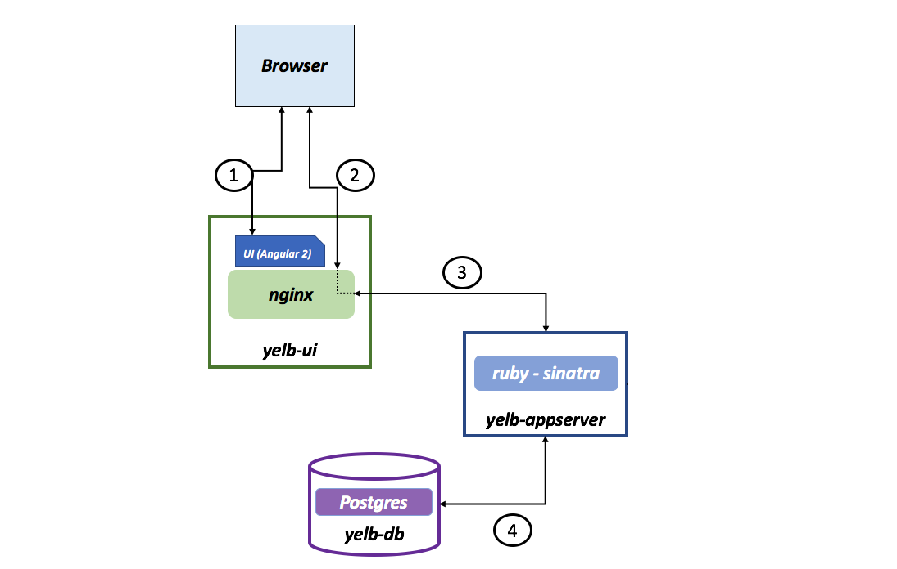
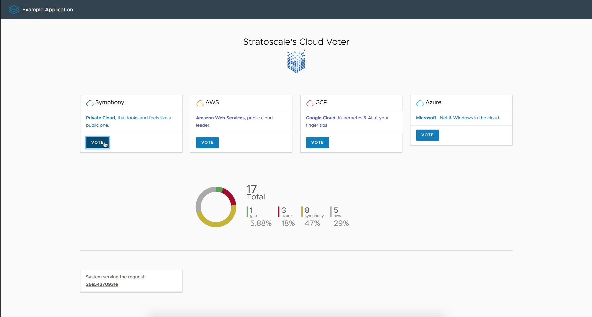

#### Cloud Voter App, (aka Yelb) 

Yelb is a cloud-native application written from scratch (leveraging existing frameworks and tools such as Sinatra, Angular2 and others).   
As a cloud-native app it can be easily deployed on top of amazon, as well as a Symphony region.   
The deployments section of this repository includes a full terraform module to deploy "Yelb" on either an aws public cloud, or either a private aws-compatible region, e.g Stratoscale Symphony. 

#### Yelb architecture

The current architecture layout is pretty straightforward. 

There is a front-end component called `yelb-ui` that fullfills a couple of roles (they could even be split if need be). The first role is to host the Angular 2 application (i.e. the UI of the Yelb application). When the browser connects to this layer it downloads the `Javascript` code that builds the UI itself. Subsequent requests and calls to other application components are proxied via the `nginx` service running on `yelb-ui`. 

At the time of this writing the only application component that exists is `yelb-appserver`. This is a Sinatra application that basically reads and writes to a Postgres backend database (`yelb-db`). Postgres is used to persist the votes. Note that the `yelb-db` container image is nothing more than Postgres (10) customized to create the database schema the application relies on.   

The picture below shows the architecture of Yelb:

#### What does Yelb do?

Yelb allows users to vote on their favorite cloud provider and dynamically updates pie charts based on number of votes received. In addition it prints the hostname of the `yelb-appserver` instance serving the API request upon a vote or a page refresh. This allows an individual to demo the application solo, or involving people (e.g. an audience during a presentation) asking them to interact by pointing their browser to the application and voting their favorite cloud provider.    

This is how the UI looks like at this point:

The nature of the app allows people to experiment with the statless `yelb-ui` and `yelb-appserver` components (think scaling out, blue/green depoyments, etc.) as well as experiment with the stateful `yelb-db` backend component. 

#### Known issues and limitations

- There is a subtle issue when you browse the app for the first time where the browser console shows errors. This is likely due to problems with variables not initialized properly. This needs further investigation. The app works just fine and there is no evidence of the problem unless you inspect the page and go to the console outputs.   
- There is a ton of optimization that could be achieved both in the application code as well as in the packaging constructs (e.g. Dockerfiles). The package in its current form works but it is far from being considered optmized.
- While the intent was to build an application whose layers could scale out (and scale independently) in a classic microservices scenario, very little testing has gone into scale out deployment scenarios so far. Most of the tests have been done with one (1) instance of service per layer.
- The database tables / entries still holds the old 'restaurants' notion of the app, and are mapped by the ap server to cloud providers.

#### Credit
Thanks [Massimo Referre](https://www.linkedin.com/in/massimoreferre/) for writing the original yelb app, making it simple to use and modify.
